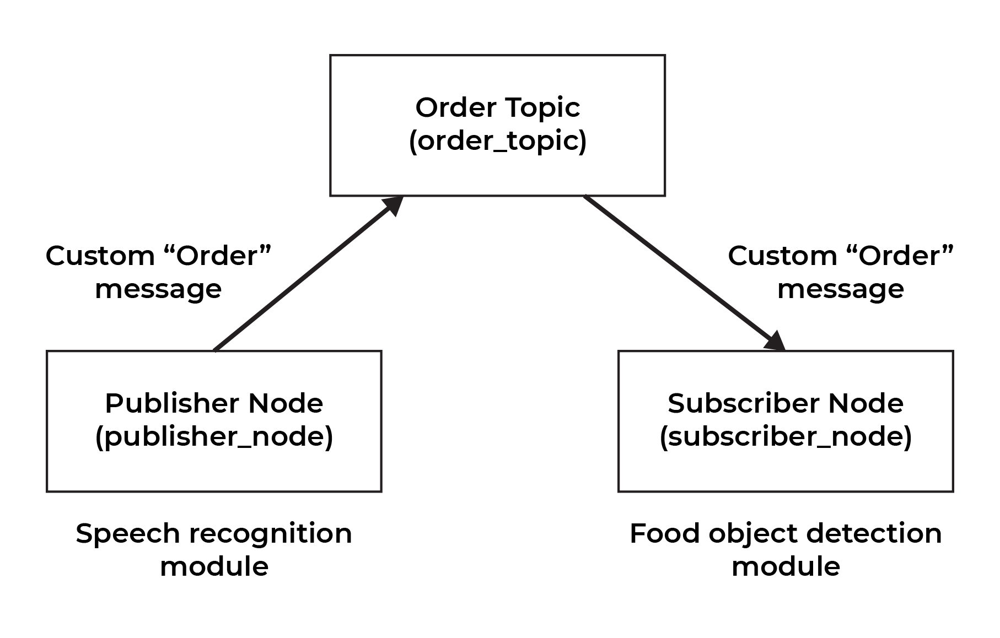

# ANNEY Robot

This is a ROS project for a waiter robot named ANNEY built for the WID3005 Intelligent Robotics course.

ANNEY Robot is a robot that works in a restaurant as a server. It takes orders by comprehending the customers' commands through speech recognition. It will submit the order received to the kitchen’s system. The robot would then use computer vision to verify the orders from the kitchen using object detection. The final idea that was unable to fulfilled would be to send the orders to the correct tables using robot movement and simultaneuos localization and mapping (SLAM).

The scope of the robot are as follows:

- Able to perform object detection on 5 Malaysian food (nasi lemak, nasi goreng, mee goreng, roti canai and satay)
- Able to understand customers and take their orders using speech recognition.
- ~~Able to deliver food to the correct table in a restaurant setting using SLAM.~~ (unable to fulfill due to time restrictions)

[Project Demo](https://drive.google.com/file/d/1YxdFAGxnfDageVoCzx2yCey40KT4FEWY/view?usp=sharing)

### The Modules

There are two developed modules in this project:

1. Speech Recognition for Taking Orders
   - This uses the SpeechRecognition module in Python where the **Google Recognizer** is used with the **"ms-MY"** language.
   - We found that this had the flexibility of handling the "rojak" or mixed nature of Malaysian conversational language.
2. Object Detection for Food Recognition
   - A custom PyTorch model was trained using transfer learning on a Faster-RCNN model with the MobileNetV3-Large backbone.
   - [Model Documentation](https://pytorch.org/vision/stable/models/generated/torchvision.models.detection.fasterrcnn_mobilenet_v3_large_320_fpn.html)
   - The model is trained to detect 5 classes: nasi lemak, nasi goreng, mee goreng, roti canai and satay.
   - The dataset used to train the model was adapted from [Kaggle](https://www.kaggle.com/datasets/karkengchan/malaysia-food-11) where the annotations were manually done by the team members.
   - This model was then used in conjunction with OpenCV to perform real-time inferencing.
   - An additional object tracking system was included to prevent duplicate detection of orders when operating in the robot.

### The ROS Project

The ROS project, `anney_ros_melodic` contains a single package `anney_melodic_pkg`. This package contains two nodes: The **order_publisher** node and the **order_subscriber** node. The structure of the system and the modules included in the nodes are illustrated in the following diagram.



The publisher_node (**order_publisher.py**) prompts the user for the table number and allows the user to record their orders. Speech recognition and regex are then used to process and extract the orders and their corresponding quantities.

Procedure to order:

1. Press and hold **spacebar** to start the recording process.

2. The specific dialog required for the robot to identify orders is as follows:

   ```
   I want to order <quantities> <food item>
   ```

   - Note that the current implementation found that quantities spoken in Malay are preferred, eg. "I want to order satu nasi lemak"
   - The quantities and food items can also be spoken in a sequence, eg. "I want to order satu nasi lemak, dua satay"
   - If the detected quantities are in word form, they are normalized into numbers up to 9, eg. "satu -> 1, dua -> 2"

3. Release **spacebar** to pause the recording.
4. The user can continue the recording by holding **spacebar** again or stop the recording by pressing the **right arrow key** button.

The robot would attempt to recognise the orders and publish a custom **Order** message to the specified topic.

The **Order** message contains attributes:

- table_num in the form of a string
- orders in the form of a string array
- units in the form of an integer array

There is then a corresponding subscriber_node (**order_subscriber.py**) that subscribes to this order_topic and receives incoming Order messages. Once there is an Order message, the node starts the camera and object detection module which attempts to detect the correct orders. The detected orders are removed from a temporary list, indicating that the orders are fulfilled and ready to be sent. Once the list is empty, the robot should be ready to send the orders to the correct table. The video capture would then end, allowing the next detection process to continue based on the topic queue.

**Note:** There is also a manual process to terminate the object detection module if required. (press the d key)

The use of a topic allows for a natural queue where if multiple orders are submitted, the subscriber node would execute the object detection process sequentially. For example, if there are two orders, the detection for the first order would be executed until completion which will end the video capture. This process would then start again to detect and verify the second orders.

### Running the Project

**Note:** This project was built using **ROS Melodic** on Ubuntu 18.04. This distribution does not fully support the use of Python 3 modules but the use of the interpreter can be enforced using the shebang `#! /usr/bin/env python3` at the top of the node scripts. However, if there are issues, this was the guide was followed: https://www.dhanoopbhaskar.com/blog/2020-05-07-working-with-python-3-in-ros-kinetic-or-melodic/.

It is possible to run the project in a WSL environment. However, there is a limitation in using hardware devices where the project won't work properly.

Otherwise, the project can be run using the following steps:

1. Git clone this repository using
   ```
   git clone https://github.com/tengznaim/anney-robot/
   ```
2. Navigate into this project directory.
3. Install the Python requirements using
   ```
   pip3 install -r requirements.txt
   ```
4. Ensure that you have ROS installed in the system, either locally or in the bot.
5. Navigate into the `anney_ros_melodic` directory and build the project using
   ```
   catkin_make
   ```
6. Run the setup script using
   ```
   source devel/setup.bash
   ```
7. Start roscore using
   ```
   roscore
   ```
8. Open new separate terminals and run the nodes

   ```
   rosrun anney_melodic_pkg order_publisher.py
   ```

   ```
   rosrun anney_melodic_pkg order_subscriber.py
   ```

   - Note that the **setup command in point 6** would also be required whenever opening a new terminal.
   - Due to possiblity of the devices (microphone and camera) being connected differently, you may also need to change the device index in both the node scripts.
   - You can run the `check_devices.py` script to identify the available devices. You would then need to identify which of the devices belong to the robot or the device you'd like to test the project on.

   i. Microphone in **order_publisher.py**

   ```
   def __enter__(self):
        self.p = pyaudio.PyAudio()
        self.stream = self.p.open(format=FORMAT,
                             channels=CHANNELS,
                             rate=RATE,
                             input=True,
                             frames_per_buffer=CHUNK,
                             stream_callback = self.callback,
                             input_device_index=CHANGE_THIS)
   ```

   ii. Camera in **order_subscriber.py**

   ```
   capture = cv.VideoCapture(CHANGE_THIS)
   ```

### Limitations

1. The speech recognition module could interpret quantities in string form or numeric form (eg. "satu" or 1). When the orders are interpreted in string form, there is a limitation in normalizing them into numbers. The current implementation only normalizes quantities from 1-9.
2. The object detection module is highly sensitive to the performance of the model. Since the model is not fully tuned, it can missclassify the detected foods with many being classified as "satay" and "nasi_goreng".
   - "mee_goreng" is also the worst performing class as the training dataset had the least number of images for this class and they were of low quality.
   - This also means that the fulfillment of the orders in the object module can be inaccurate as the model can detect an empty plate as "nasi goreng"
3. Speech recognition also resulted in detected foods having different spelling compared to our defined class labels. (eg. **mi goreng** instead of **mee goreng** and **sate** instead of **satay**)
4. The frame rate for object detection is lower due to object tracking rather than continuous detection and classification.
5. There is no error handling for when the ordered food is not in the classes defined. For example, **"I want to order tiga kerusi"** is accidentally taken as a valid order.

### Contributions

1. Muhammad Afiq Irfan bin Manor | [GitHub](https://github.com/Fiquee)
2. Khairol Hazeeq bin Khairol Nizat | [GitHub](https://github.com/kerolzeeq)
3. Tengku Ahmad Naim Nuruddin | [GitHub](https://github.com/tengznaim)
4. Muhamad Azri Anwar bin Azahar | [GitHub](https://github.com/nepulepu)
5. Muhammad Luqmanul Hakim bin Zulkarnain | [GitHub](https://github.com/mnulll)
